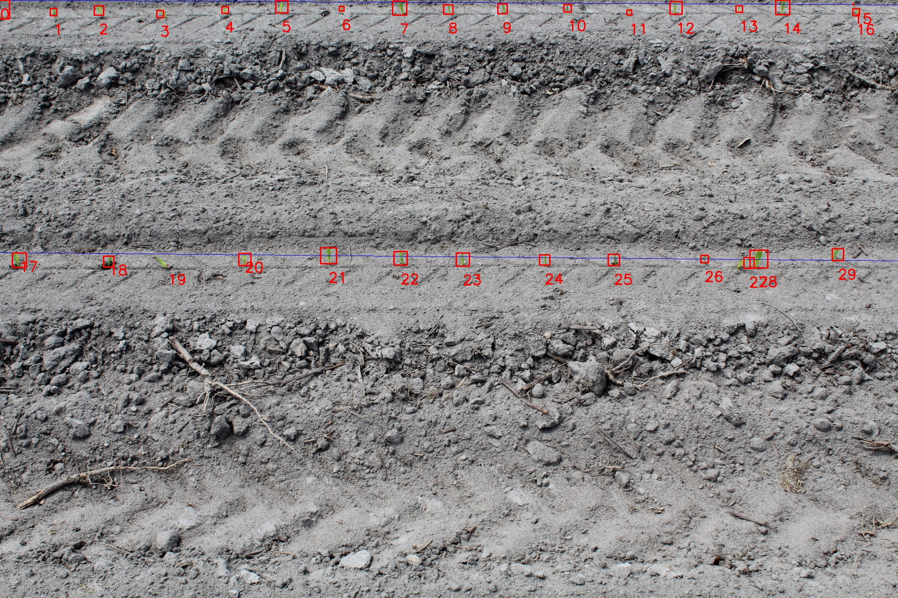

# NCSU Image Threshold for Plant Height Measurement

## Purpose 
The purpose of this program is to get emergence count data from a picture of a planted row. 

Output: 
>Heights: [40, 15, 20, 15, 14, 26, 10, 30, 20, 21, 16, 11, 27, 14, 31, 2, 15, 31, 23, 0, 26, 34, 29, 28, 22, 24, 16, 23, 38, 25]
>
> Average Height: 21
>
> Spacing: [114, 97, 131, 139, 121, 128, 124, 104, 116, 139, 132, 100, 135, 93, 151, 6, -1789, 191, 121, 170, 179, 154, 133, 175, 148, 194, 95, 21, 169]
>
> Average Spacing: 61

## Method 
The program uses **threshold masking** with opencv2 to identify pixels with the correct hue and saturation. 
To find the approriate HSV values for a specific image or set of images, set ***is_manual*** to "True". When the program runs it will display trackbars and a maksed image. Adjust these values and the new values will display in a small side window. Once saved, these values will be used to process the images. Ideally, the mask should make the entire image black except for the plants.

Sklearn **clustering** is then used to identify specific plants, acquiring the top y value, bottom y value, and center x value.

These values are sorted into horizontal rows starting from the upper left corner.

Using Opencv, each cluster is draw with a box around it and its index number as a label. There is also a line drawn indicating each row.

## Modes
Default **IS_MANUAL is False** and the default values are Upper HSV: [20,100,50] and Lower HSV: [80, 250, 200]).

If **IS_MANUAL is True**  windows appear with trackbars and adujstable HSV values. The user can choose which values to use for the mask. 

[Default] **AUTO_PROCESS is False** then the images will be displayed one by one and the user can click to add or remove data points before moving to the next image or skip an image. Results will be printed when moving to next image. 

If **AUTO_PROCESS is True** all the images in the "/pictures" folder will be processed and the resulsts printed as they finish. 

## User Interaction

While running, one image is displayed at a time. The user can click on the image to either add or remove a cluster point. If the user hits enter, the results will be printed and the next image is shown. The user can also hit delete to skip that image without printing results and move onto the next. 

# Important Notes
All images will be pulled from a "/pictures" folder and must be of type .JPG. This can be changed on Line 7. 

This can be slow to process, especially when using the trackbars. So after something is clicked, the user should wait a few seconds. # NCSU
